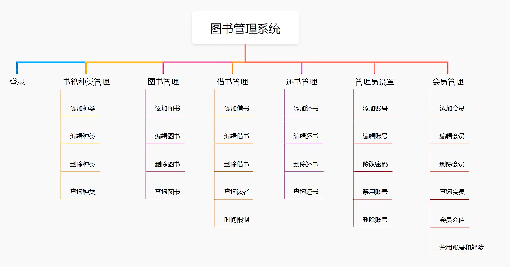

# 图书管理系统

本项目是使用 Spring Boot 框架开发的一个在线图书管理系统。

## 技术栈

- 后端框架
  - SpringBoot
  - mybatis
  - hutool
- 数据库
  - MySql
- 前端框架
  - Vue
  - ElementUI
  - Vue-Router
  - Axios
  - ECharts
    
## Windows 开发环境搭建

1. 安装 Java JDK 8 并配置环境变量
2. 安装 MySQL、Redis 数据库并创建相应数据库

   - 创建 MySQL 数据库与表: 运行 [mysql.sql](./db/db_library.sql)

3. 安装 Maven 构建工具
4. 克隆项目到本地 `git clone https://github.com/ScholarChen20/Vue3.git `
5. 修改配置文件 [application.yml](./src/main/resources/application.yml)
   
    ```yml
    spring:
       datasource:
          driver-class-name: com.mysql.jdbc.Driver
          url: jdbc:mysql://localhost:3306/数据库名?useUnicode=true&characterEncoding=utf8&useSSL=false
          username: mysql用户账号
          password: mysql用户密码
   
    server: 
      9090
    mybatis:
        mapper-locations: classpath:mapper/*.xml
        configuration:
        map-underscore-to-camel-case: true
    ```
6. 配置node.js运行前端框架
7. 运行SpringBoot框架和前端界面即可
8. 系统功能图




## Project setup
```
npm install
```

### Compiles and hot-reloads for development
```
npm run serve
```

### Compiles and minifies for production
```
npm run build
```

### Customize configuration
See [Configuration Reference](https://cli.vuejs.org/config/).
